<!-- ======================= HEADER ======================= -->

  

<!-- ======================= TERMINAL ======================= -->

  

 

---

<!-- ======================= GITHUB ANALYTICS ======================= -->

#  GitHub Analytics

 

  

<!-- STREAK -->

  

 

<!-- ACTIVITY GRAPH -->

  

 

<!-- TROPHY -->

  

---

